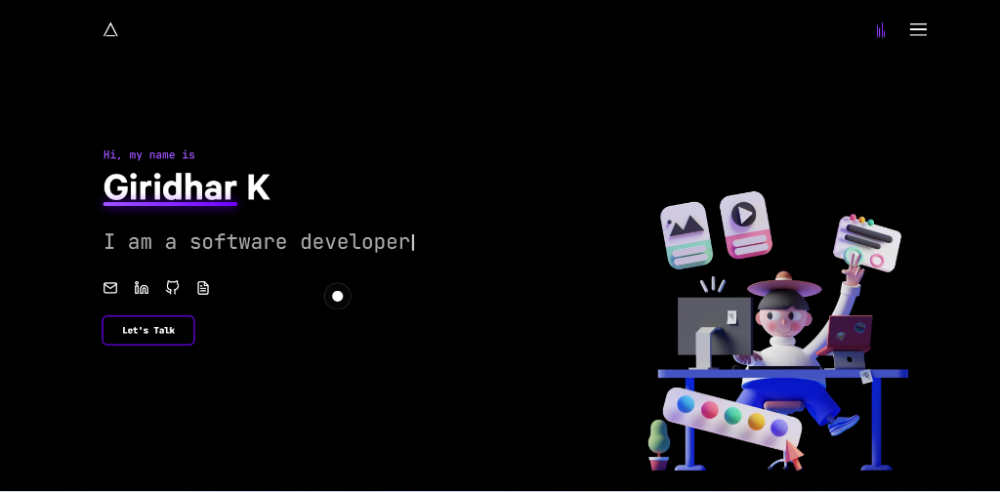

# 🚀 Giridhar K - Portfolio

A modern, interactive portfolio website showcasing my expertise in **Python Development**, **Machine Learning**, and **Artificial Intelligence**.



## ✨ Features

- **Interactive Project Showcase** - Click on any project card to view detailed information in an elegant modal
- **Responsive Design** - Fully optimized for desktop, tablet, and mobile devices
- **Smooth Animations** - Professional transitions and hover effects using Framer Motion
- **Modern Tech Stack** - Built with Next.js, React, and Tailwind CSS
- **SEO Optimized** - Proper meta tags and semantic HTML for better discoverability

## 🛠️ Tech Stack

### Frontend
- **Framework:** Next.js 13
- **UI Library:** React 18
- **Styling:** Tailwind CSS, SCSS
- **Animations:** Framer Motion, GSAP
- **Icons:** Custom SVG components

### Development Tools
- **Package Manager:** Yarn
- **Version Control:** Git
- **Code Quality:** ESLint

## 📂 Project Structure

```
Portfolio/
├── components/          # React components
│   ├── Hero/           # Landing section
│   ├── Skills/         # Skills showcase
│   ├── Projects/       # Project cards & modal
│   ├── Work/           # Work experience
│   └── Footer/         # Footer section
├── pages/              # Next.js pages
├── public/             # Static assets
│   ├── skills/        # Skill icons
│   └── projects/      # Project images
├── styles/             # Global styles
└── constants.js        # Site configuration & content

```

## 🎨 Key Sections

### Home
- Eye-catching hero section with animated 3D character
- Dynamic typing effect showcasing my roles
- Quick access to social profiles and resume

### Skills
Organized into four categories:
- **Programming Languages:** Python, HTML, CSS, Streamlit
- **Frameworks & Libraries:** NumPy, Pandas, Scikit-learn, TensorFlow, Keras, FastAPI
- **Databases:** SQL (MySQL)
- **Developer Tools:** Git, VS Code, GitHub

### Projects
Interactive project cards featuring:
- **Job Role Prediction System** - ML model with 85%+ accuracy
- **Data Analytics & Predictive Modeling** - End-to-end data pipeline with Power BI
- **DocuQuery AI** - AI-powered document chatbot with semantic search
- **Finance Tracker** - Personal finance app with interactive visualizations

### Work Experience
- **UptoSkills** - Artificial Intelligence Intern (Oct 2025 - Present)
- **Infosys Springboard** - Python Intern (Sep 2025 - Nov 2025)
- **Rooman Technology** - Data Analyst Intern (May 2025 - Jul 2025)

## 🚀 Getting Started

### Prerequisites
- Node.js 16.x or higher
- Yarn package manager

### Installation

1. Clone the repository
```bash
git clone https://github.com/Giri1529/portfolio.git
cd Portfolio
```

2. Install dependencies
```bash
yarn install
```

3. Run the development server
```bash
yarn dev
```

4. Open [http://localhost:5000](http://localhost:5000) in your browser

### Build for Production

```bash
yarn build
yarn start
```

## 📱 Responsive Design

The portfolio is fully responsive and optimized for:
- 📱 Mobile devices (320px and up)
- 📱 Tablets (768px and up)
- 💻 Desktops (1024px and up)
- 🖥️ Large screens (1440px and up)

## 🎯 Performance

- **Fast Loading** - Optimized images with Next.js Image component
- **Smooth Animations** - Hardware-accelerated CSS and Framer Motion
- **SEO Friendly** - Server-side rendering with Next.js
- **Accessibility** - Semantic HTML and ARIA labels

## 🌐 Deployment

This portfolio is deployed on **Vercel** for optimal performance and reliability.

[](https://vercel.com/new/clone?repository-url=https://github.com/Giri1529/portfolio)

## 📧 Contact

- **Email:** giridhar.cseai@gmail.com
- **LinkedIn:** [linkedin.com/in/giridhar-k-90197929b](https://www.linkedin.com/in/giridhar-k-90197929b/)
- **GitHub:** [github.com/Giri1529](https://github.com/Giri1529)
- **Resume:** [View Resume](https://drive.google.com/file/d/14kcq_XSKeuLNFuJMcEuvMJzWd5WpqxkP/view?usp=sharing)

## 📄 License

This project is open source and available under the [MIT License](LICENSE).

## 🙏 Acknowledgments

- Design inspiration from modern portfolio trends
- Icons and illustrations from various open-source projects
- Special thanks to the Next.js and React communities

---

**Built with ❤️ by Giridhar K**

*Passionate about building intelligent solutions using Python, Machine Learning, and AI technologies.*
